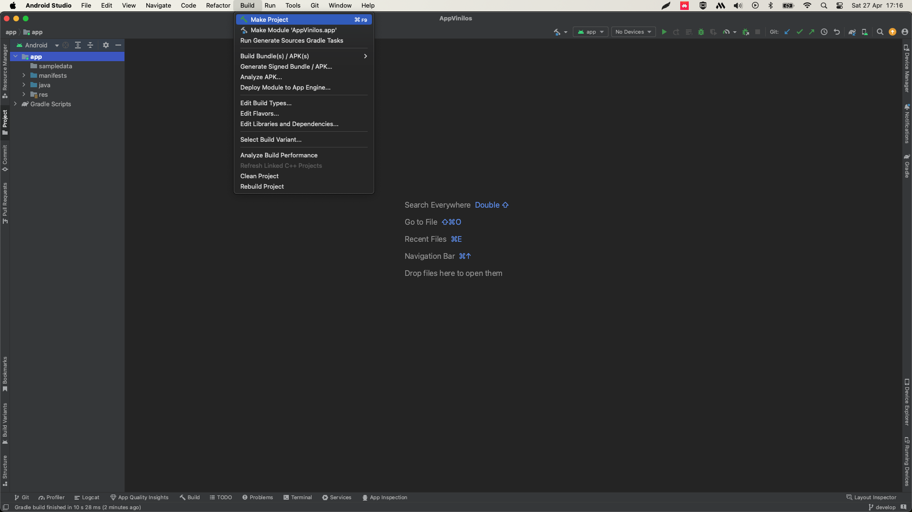
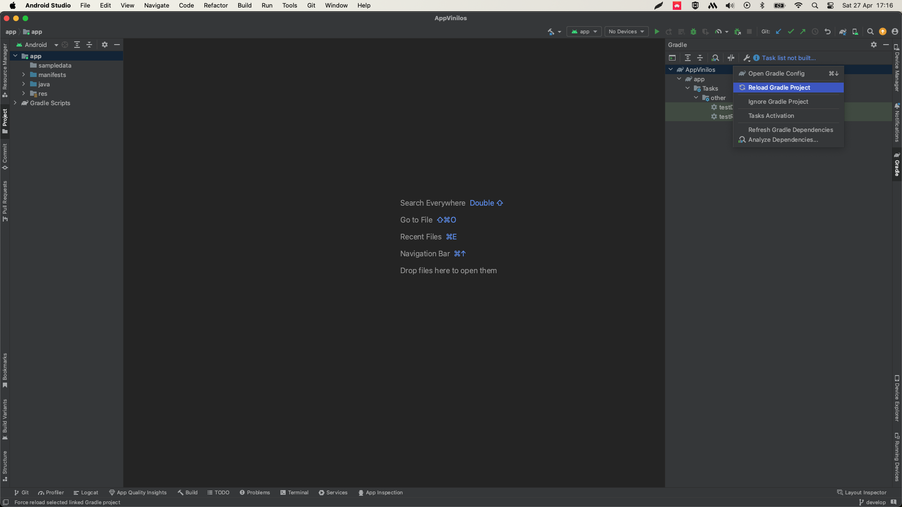
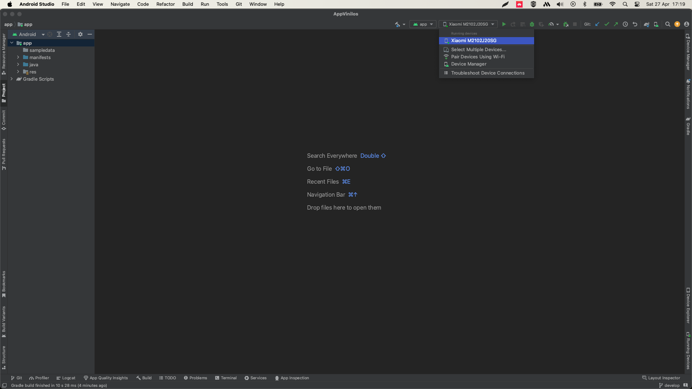
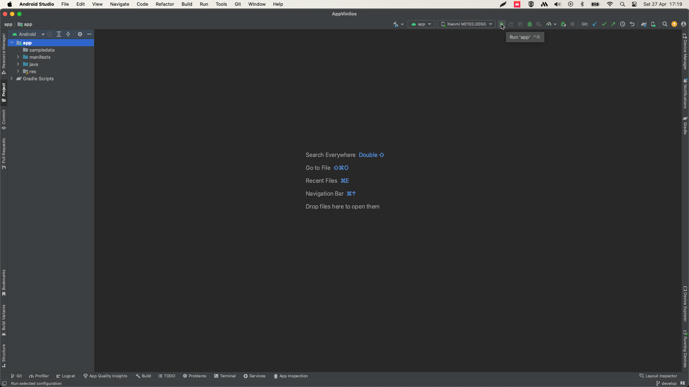
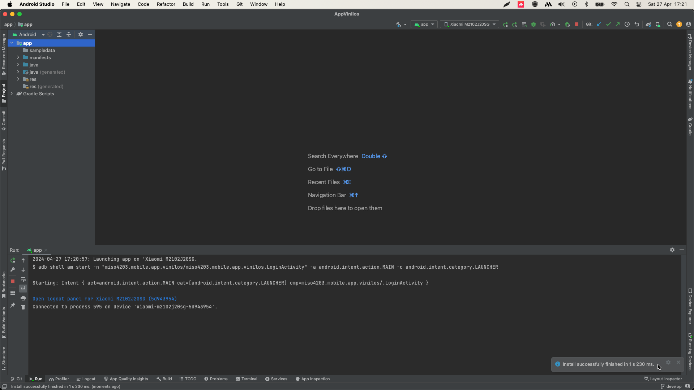

# MISW-4204-Proyecto-MISW4204-202402-Grupo10

## Grupo 8

## Integrantes

| **Name**                        | **Email**                   |
|---------------------------------|-----------------------------|
| Jhon Edinson Muñoz Riaños       | je.munozr1@uniandes.edu.co  |
| Juan Carlos Torres Machuca      | jc.torresm1@uniandes.edu.co |
| Cristian Eduardo Parada Criales | c.paradac@uniandes.edu.co   |
| Cristian Zapata Torres          | c.zapatat@uniandes.edu.co   |

## Requerimientos

### Android Studio

La versión indicada para trabajar sobre el proyecto **Giraffe | 2022.3.1 Patch 3**
Esta versión la puede encontrar en el siguente enlace: [Link](https://developer.android.com/studio/archive),
asegurece que la página carga en inglés, realice scroll hasta encontrar el botón para aceptar terminos y condiciones,
luego busque la siguiente opción

*Android Studio Giraffe | 2022.3.1 Patch 3 November 7, 2023*

### JDK

La versión indicada para trabjar sobre el proyecto:

```ini
java 17.0.7 2023-04-18 LTS
Java(TM) SE Runtime Environment (build 17.0.7+8-LTS-224)
Java HotSpot(TM) 64-Bit Server VM (build 17.0.7+8-LTS-224, mixed mode, sharing)
```

### Emulador

```ìnit
Sistema operativo: Android 33
Dispositivo: Xiaomi M2101K7BL API33
```

### Pasos usando Android Studio

### Paso 0: Inicie Android Studio con el proyecto cargado, se reocmienda la vista *Android*

#### Paso 1: Dirijase a la opción *Build* y luego seleccione *Clean project*



#### Paso 2: Cargar dependencias, dirigase a la opción *Gradle* sobre las opciones al lado derecho del editor, click derecho sobre el proyecto,luego *Reload Gradle Project*



#### Paso 3: Seleccione su dispositivo el cual puede ser virtual o físico
En caso de ser virtual y no contar con uno, dirijase *Device Manager* donde podrá crea uno,
como recomendación que cumpla las carateristicas recomendadas previamente.



#### Paso 4: Proceda a ejecutar la aplicación sobre el dispositivo seleccionado



#### Paso 5: como resultado Android Studio inicio la construcción
Según sea el tipo de dispositivo la aplicación iniciará en su dispositivo físico o iniciar su
dispositivo virtual y luego la aplicación.

Sobre el dispositivo fisico debe contar con permisos de desarrollador.

